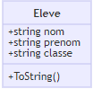

# Les accesseurs

## Introduction

Afin de simplifier les choses, les accesseurs (en lecture ou écriture) on été créés. Ils permettent d'accéder facilement
aux attributs d'un objet. Ils se traduisent par les mots clés **get** (en lecture) et **set** (en écriture).

## Examples

La classe *Eleve* a plusieurs attributs. Si on veut utiliser ailleurs que dans la classe elle-même, on créé des 
accesseurs (en lecture et écriture).



```java
public class Eleve
{
    // ...
    
    // Accesseurs
    // En lecture
    public String getNom()
    {
        return this.nom;
    }
    
    public String getPrenom()
    {
        return this.prenom;
    }
    
    public String getClasse()
    {
        return this.classe;
    }
    
    // En écriture
    public void setClasse(string classe)
    {
        this.classe = classe;
    }
}
```